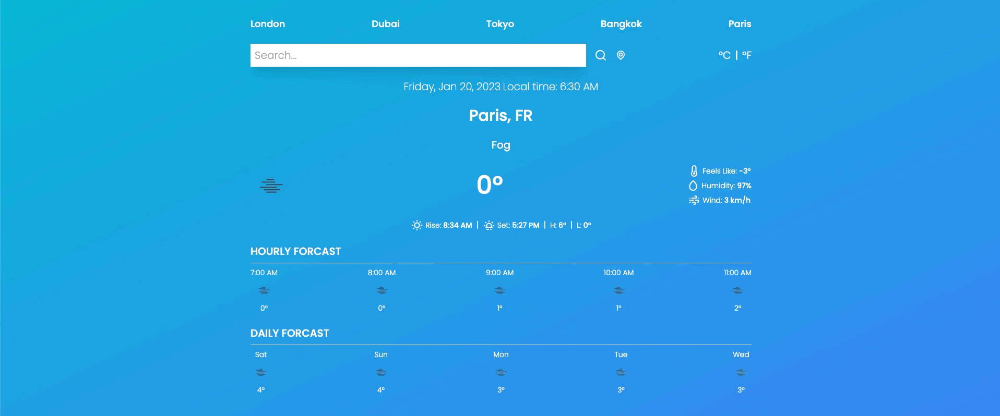
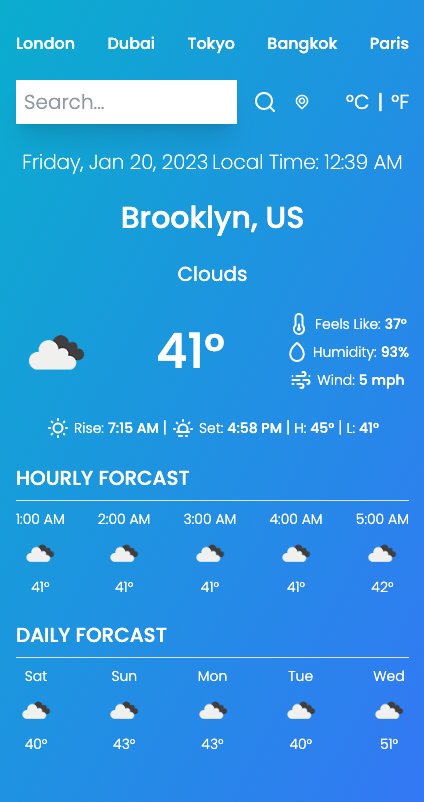
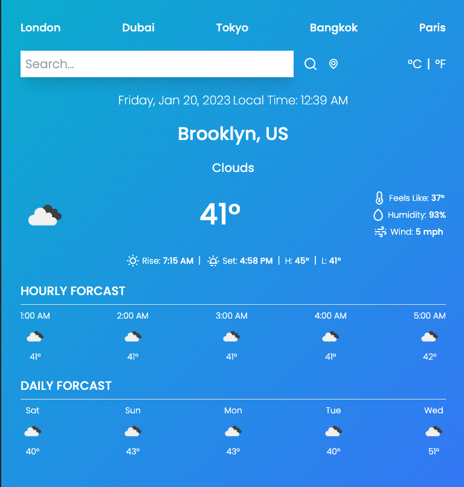
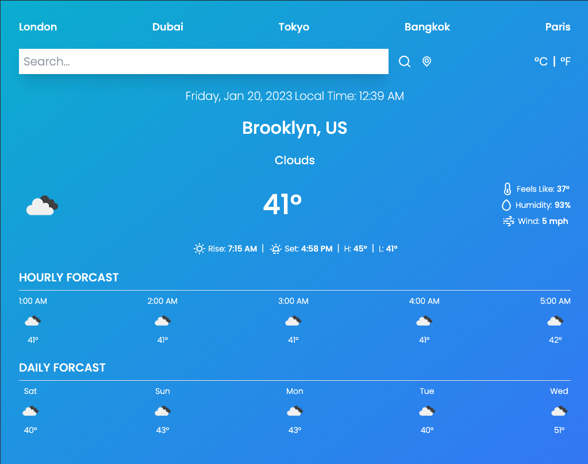

<p align="center">
    
</p>

## Overview

This is a responsive Weather App created with ReactJS. The application utilizes the OpenWeather API to
provide hourly and daily forcast for either a specified city or the user's current location. It supports
both metric and imperial units. Unforunately, I will not host this project on GitHub Pages to prevent
sharing my OpenWeather API key. I have instead included a gif demoing the project above.

The application was designed to be responsive for various device sizes as seen below:

- Mobile Devices:
  <br>
  
- Tablet Devices:
  <br>
  
- Laptop and Desktop Devices:
  <br>
  

## Getting Started

### Prerequisites

- yarn
  ```sh
  npm install -g yarn
  ```

### Installation

1. Clone the repo
   ```sh
   git clone https://github.com/klam2k20/Weather.git
   ```
2. `cd` to project folder
3. Install yarn packages
   ```sh
   yarn install
   ```
4. Sign up for One Call API 3.0 subscription
5. Obtain an API key
6. `cd src`
7. Create `.config.js` with your API key

   ```js
   const config = {
   	WEATHER_API_KEY: { API_KEY },
   };
   export default config;
   ```

8. Start React project
   ```sh
   yarn start
   ```
