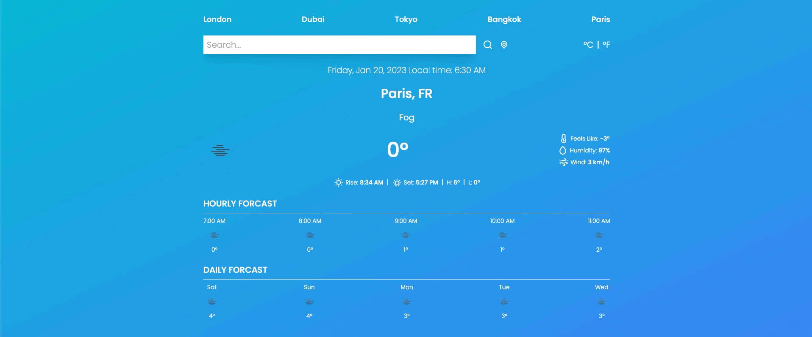
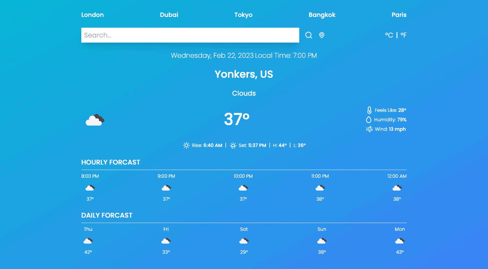
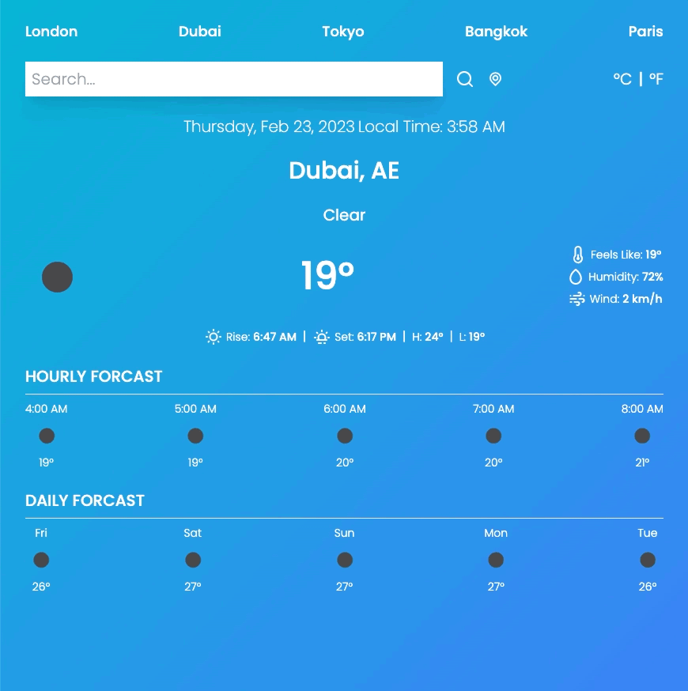
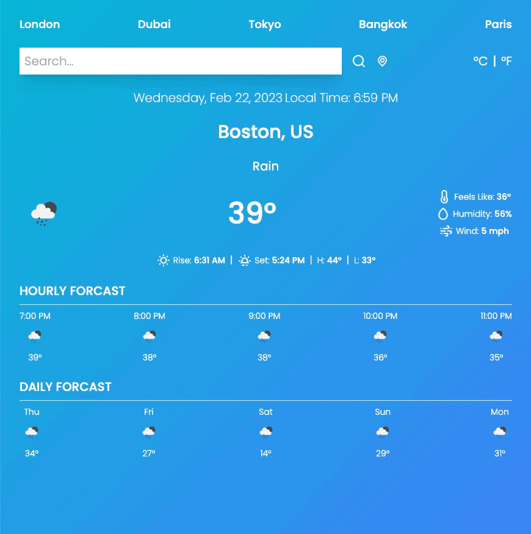

<p align="center">
    
</p>

## Overview

This is a responsive Weather App. It utilizes the OpenWeather API to provide hourly and daily
forcast for either a specified city or the user's current location. It supports both metric and imperial units.

## Technology

- 
- 

## Features

- Responsive Design
<p align="center">
    
</p>

- Supports Metric and Imperial Units
<p align="center">
    
</p>

- Provides Forcast for User's Location
<p align="center">
    
</p>

## Getting Started

### Prerequisites

- yarn/npm
- Sign up for One Call API 3.0 Subscription

#### Installation

```sh
# Clone the repo
git clone https://github.com/klam2k20/Weather.git

# Create .config.js
cd Weather/src
const config = {
	WEATHER_API_KEY: { API_KEY },
};
export default config;

# Install dependencies
yarn install

# Start the application
yarn start
```
